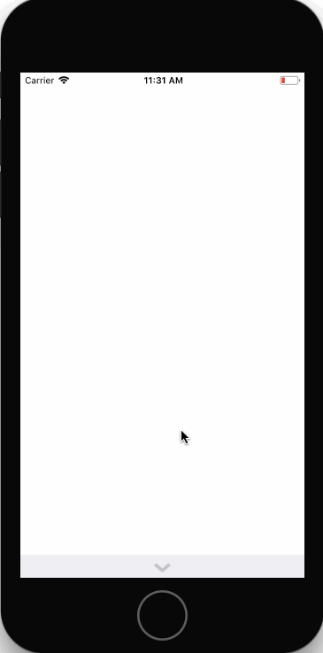

# canvas

An iOS app for adding smiley stickers to a canvas

Time spent: 1.5 hours

## User Stories

- [x] User can expand/hide a tray that contains the current smiley stickers to choose from
- [x] Tray movements are animated
- [x] User can drag a smiley sticker onto the canvas
- [x] User can reposition the smiley sticker anywhere on the canvas
- [x] User can add as many stickers as desired
- [ ] User can pinch to resize the sticker
- [ ] User can rotate the sticker
- [ ] User can drag to return a new sticker back to the tray
- [ ] User can delete the sticker by double-tapping
- [ ] Tray arrow faces up or down depending on open/closed state
- [ ] Tray exhibits friction when user tries to drag it past open state

## Video Walkthrough

Here's a walkthrough of implemented user stories:

GIF created with [LiceCap](http://www.cockos.com/licecap/).

## Notes

This exercise demonstrates gesture recognizers and animations

## License
Credits:
- Graphics provided by CodePath [http://www.codepath.com/]

  MIT License

  Copyright (c) 2017 Angela Yu

  Permission is hereby granted, free of charge, to any person obtaining a copy
  of this software and associated documentation files (the "Software"), to deal
  in the Software without restriction, including without limitation the rights
  to use, copy, modify, merge, publish, distribute, sublicense, and/or sell
  copies of the Software, and to permit persons to whom the Software is
  furnished to do so, subject to the following conditions:

  The above copyright notice and this permission notice shall be included in all
  copies or substantial portions of the Software.

  THE SOFTWARE IS PROVIDED "AS IS", WITHOUT WARRANTY OF ANY KIND, EXPRESS OR
  IMPLIED, INCLUDING BUT NOT LIMITED TO THE WARRANTIES OF MERCHANTABILITY,
  FITNESS FOR A PARTICULAR PURPOSE AND NONINFRINGEMENT. IN NO EVENT SHALL THE
  AUTHORS OR COPYRIGHT HOLDERS BE LIABLE FOR ANY CLAIM, DAMAGES OR OTHER
  LIABILITY, WHETHER IN AN ACTION OF CONTRACT, TORT OR OTHERWISE, ARISING FROM,
  OUT OF OR IN CONNECTION WITH THE SOFTWARE OR THE USE OR OTHER DEALINGS IN THE
  SOFTWARE.
